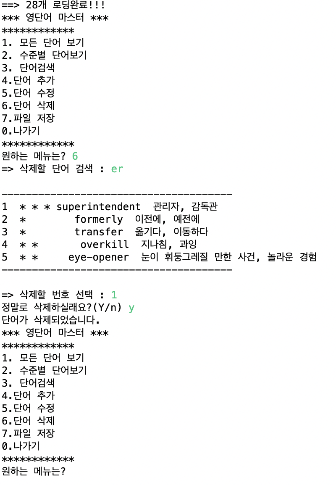
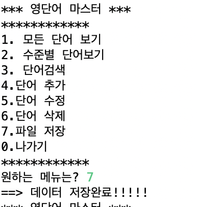

# English_Word

1번 기능(저장 불러오기)
.png)

2번 기능(수준별 단어 보여주기)
.png)

3번 기능(단어검색기능)
.png)

4번 기능(단어추가기능)
.png)

5번 기능(단어변경 뜻 변경하기)
.png)

5번 기능(단어변경 단어 변경하기)
.png)

5번 기능(단어변경 모든 단어 변경하기)
.png)

6번 기능(단어삭제하기)

7번 기능(단어저장하기)
.png)

TXT파일 

